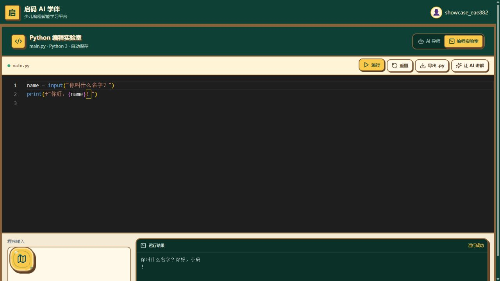
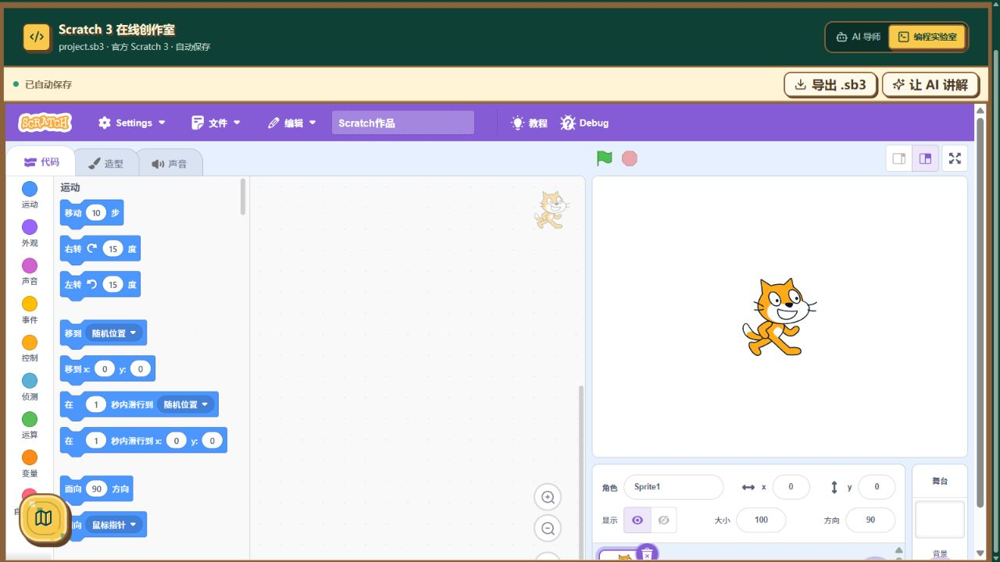
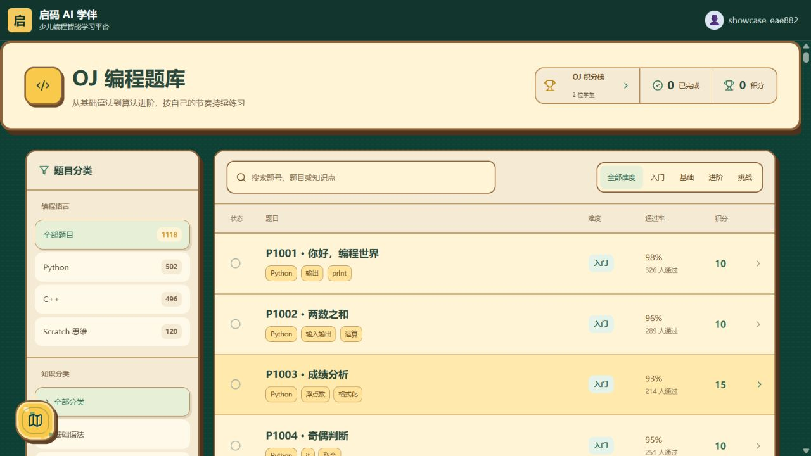

# 启码 AI 学伴

面向少儿编程学习的 AI 教学与练习平台，将 **AI 导师、学习路线、在线编程、知识库与班级教学** 放进同一个学习空间。支持 Scratch、Python 和 C++，覆盖从图形化编程入门到代码练习与竞赛启蒙的学习过程。

本仓库提供前后端源码，以及面向 Ubuntu 24.x / x86_64 服务器的 Docker 部署脚本。学生可以自主学习与练习，教师可以管理班级、课程资料、作业和竞赛，开发者可以维护机构与平台配置。

[效果展示](#效果展示) · [功能概览](#功能概览) · [技术栈](#技术栈) · [快速部署](#快速部署) · [部署与使用手册](docs/部署与使用手册.md)

## 效果展示

以下图片均截取自本地运行的项目，使用专门的演示账号。AI 学习界面包含项目预置的示例对话，题库中的通过率、通过人数等包含内置示例数据，不代表真实运营成绩。

### AI 导师与学习路线

在 Scratch、Python、C++ 三个学习方向之间切换，通过对话理解知识点；侧边学习助手提供分阶段路线、笔记、练习和错题入口。


### 学习空间首页

以像素风学习场景呈现每日目标和成长概览，集中提供单人学习、机构课程、班级空间、作业中心、OJ 题库与编程竞赛入口。


### Python 编程实验室

在浏览器中编辑代码、填写标准输入并查看运行结果，支持导出源码和切换到 AI 讲解。下图展示了实际执行成功的 Python 输入输出示例；平台也提供 C++ 编程工作区。



### Scratch 3 在线创作室

内嵌 Scratch 3 编辑器，提供积木分类、角色、舞台、造型和声音编辑，支持作品自动保存与 `.sb3` 文件导出。



### OJ 编程题库

按编程语言、知识分类和难度筛选题目，支持搜索题号、题目与知识点。Python、C++ 代码题与 Scratch 作品题采用相应的练习和提交方式。



### 多角色登录入口

学生、教师与开发者使用各自的登录入口，进入对应的学习或管理空间。


## 功能概览

| 模块 | 主要功能 |
| --- | --- |
| AI 学习导师 | 多轮问答、代码讲解、追问、会话管理与分享；支持通俗讲解、苏格拉底式引导、复习和测验等模式 |
| 学习管理 | Scratch / Python / C++ 学习路线、知识点进度、笔记、练习、错题与学习报告 |
| 在线编程 | Python / C++ 代码编辑与运行、标准输入、结果查看、源码导出；Scratch 3 作品编辑与保存 |
| 知识库与资料 | 内置学习资料、文档上传、向量检索与知识库问答、机构课程资料 |
| 班级与作业 | 班级管理、学生加入班级、教师布置作业、学生提交与批改流程 |
| 题库与竞赛 | 分类题库、代码评测、Scratch 作品提交、竞赛管理、积分与成绩统计 |
| 平台管理 | 学生 / 教师 / 开发者角色、机构管理、AI 配置、调用额度与模拟订单 |

## 技术栈

| 层级 | 技术 |
| --- | --- |
| 前端 | React 18、TypeScript、Vite、Tailwind CSS |
| 编程工作区 | Monaco Editor、Scratch 3 |
| 后端 | Python、FastAPI、Uvicorn |
| 数据存储 | SQLite、本地文件存储 |
| 知识检索 | Sentence Transformers、FAISS |
| 模型接入 | OpenAI 兼容 API、Ollama 本地模型 |
| 部署与代码运行 | Docker Compose、Python / GCC 运行镜像 |

前端源码位于 `web/`，后端模块位于 `backend/`，应用入口为 `app.py`，检索与模型调用逻辑主要位于 `rag_engine.py`。

## 快速部署

```bash
cd /path/to/启码AI学伴-Linux交付版
chmod +x scripts/install_ubuntu.sh scripts/backup.sh
./scripts/install_ubuntu.sh
```

安装脚本会先检查 Ubuntu 和 amd64 架构，再检查/安装 Docker Engine 与 Compose；随后提示甲方自己设置管理员密钥和 AI API Key，拉取 OJ 运行镜像，构建并启动服务。

访问 `http://服务器IP:8899`。完整的功能介绍、配置方法、API 和上线注意事项见 [docs/部署与使用手册.md](docs/部署与使用手册.md)。

## 常用命令

```bash
docker compose ps
docker compose logs -f tutor
docker compose restart tutor
docker compose up -d --build
./scripts/backup.sh
```

## 重要说明

- 本交付版正式入口是 `app.py`，不包含历史 LangChain 实验入口、测试集、开发记录、运行日志、现有数据库、上传资料和模型缓存。
- 当前业务代码使用 SQLite，数据保存在 `data/`；本次没有擅自改成 MySQL。MySQL 可以另行安装，但当前版本不会读取 MySQL，安装它不会改变系统数据存储。
- AI Key、管理员密钥和 `.env` 不上传 GitHub。前端页面插图和 Scratch 3 本地运行资源已保留。
- 当前支付配置为 `mock`，上线收费前必须接入真实支付服务并完成验签、幂等、退款和对账。
